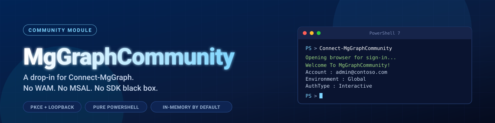

<p align="center">
  
</p>

<h1 align="center">MgGraphCommunity</h1>

<p align="center">
  A community-maintained, WAM-free drop-in alternative to <code>Connect-MgGraph</code>.
</p>

<p align="center">
  <a href="https://github.com/ugurkocde/MgGraphCommunity/actions/workflows/test.yml"></a>
  <a href="https://www.powershellgallery.com/packages/MgGraphCommunity"></a>
  <a href="https://www.powershellgallery.com/packages/MgGraphCommunity"></a>
  <a href="https://github.com/ugurkocde/MgGraphCommunity/blob/main/LICENSE"></a>
  <a href="https://learn.microsoft.com/powershell/scripting/install/installing-powershell"></a>
</p>

> Same flows. Working interactive. Safer-by-default cache. No SDK black box.

## Quick start

```powershell
Install-Module MgGraphCommunity -Scope CurrentUser
Connect-MgGraphCommunity
Invoke-MgGraphCommunityRequest -Method GET -Uri "https://graph.microsoft.com/beta/me"
```

That's it. One install. Browser opens, you sign in, you call Graph. **No `Microsoft.Graph.*` modules required.**

> Use **double quotes** around the URI as a habit. Graph IDs use OData single quotes (`('user@contoso.com')`) which would otherwise close a single-quoted PowerShell string early.

> Already have `Microsoft.Graph.Authentication` installed? Your `Get-MgUser`, `Invoke-MgGraphRequest`, etc. keep working too, because we hand off the token opportunistically.

## Why this exists

In `Microsoft.Graph` v2.34.0 (December 2025), the SDK switched interactive sign-in on Windows to the **Windows Account Manager (WAM)** broker. It became the default with no way to turn it off, and the existing opt-out options were deprecated. The change shipped with a single line in the GitHub release notes: no advance notice, no blog post, no migration guide. Admins discovered it the hard way, through broken workflows:

- Secondary / service accounts not registered on the local device fail or require full credentials (email + password + MFA) on every call.
- The classic interactive authorization-code flow (system browser, loopback redirect) is unreachable from the SDK's interactive path.
- For admins managing multiple tenants from one workstation, this is a real productivity and security regression.

### What Microsoft has changed since (verified against SDK v2.38.1, July 2026)

- **v2.35.0 (February 2026)** added an escape hatch after community backlash: `Set-MgGraphOption -DisableLoginByWAM $true`. It shipped broken, interactive sign-in simply hung until timeout ([#3518](https://github.com/microsoftgraph/msgraph-sdk-powershell/issues/3518)). **v2.35.1** fixed the hang.
- The opt-out **only takes effect with your own app registration**. The official docs now say it verbatim: WAM "is enabled by default on Windows and cannot be disabled ... Except if you use your own app", and "When using the default ClientId, WAM remains enabled regardless of this setting." With the SDK's built-in client ID, the one almost everyone uses, WAM is still mandatory.
- The maintainers describe even that opt-out as temporary: it stays for bring-your-own-app scenarios only "until WAM properly supports run as other user scenarios". The direction of travel is more WAM enforcement, not less. They have also stated that versions before 2.36.1 "will break in the future", so pinning an old SDK version is not a durable workaround.
- Multi-tenant admins remain stuck. Signing in to a customer tenant via GDAP fails through the WAM broker on Windows ([#3613](https://github.com/microsoftgraph/msgraph-sdk-powershell/issues/3613)); the issue was closed with the guidance to use device code or register your own app, because "We are forcing WAM for security purposes."
- The MSAL/WAM dependency now causes problems beyond sign-in: `Microsoft.Graph` 2.36.0+ and `ExchangeOnlineManagement` cannot be loaded in the same session due to MSAL conflicts ([#3576](https://github.com/microsoftgraph/msgraph-sdk-powershell/issues/3576), still open). A pure PowerShell module has no MSAL assemblies to conflict.

So the gap this module fills is unchanged: interactive, WAM-free, browser-based sign-in on Windows **without registering an app in every tenant you touch**, plus direct Graph access with no compiled dependencies.

The community discussion that documents what changed, why, and where Microsoft landed is this GitHub issue:

> **<https://github.com/microsoftgraph/msgraph-sdk-powershell/issues/3481>**

If you want context on the problem this module exists to solve, start there.

## What it does

`MgGraphCommunity` centers on one command, `Connect-MgGraphCommunity`, which implements the `Connect-MgGraph` sign-in flows as pure PowerShell against the Microsoft identity platform v2 endpoints (every flow except the niche `-EnvironmentVariable` set). After acquiring a token it hands it to `Connect-MgGraph -AccessToken` if `Microsoft.Graph.Authentication` is present, so all existing `Microsoft.Graph.*` cmdlets keep working unchanged. Its own `Invoke-MgGraphCommunityRequest` calls Graph directly (including binary upload/download), `Invoke-MgGraphCommunityBatch` combines requests into `$batch` calls, and `Select-MgGraphCommunityContext` switches between multiple live tenant connections, so no SDK module is ever required.

| Flow                 | How to invoke                                               |
|----------------------|-------------------------------------------------------------|
| Interactive (PKCE)   | `Connect-MgGraphCommunity` *(default, no WAM)*              |
| Device Code          | `Connect-MgGraphCommunity -UseDeviceCode`                   |
| Client Secret        | `Connect-MgGraphCommunity -ClientSecretCredential $cred`    |
| Certificate (X509)   | `Connect-MgGraphCommunity -Certificate $cert`               |
| Certificate (Thumb)  | `Connect-MgGraphCommunity -CertificateThumbprint '...'`     |
| Certificate (Name)   | `Connect-MgGraphCommunity -CertificateName 'CN=...'`        |
| Access Token (BYO)   | `Connect-MgGraphCommunity -AccessToken $secure`             |
| Managed Identity     | `Connect-MgGraphCommunity -Identity`                        |

Sovereign clouds: pass `-Environment Global|USGov|USGovDoD|China|BleuCloud|DelosCloud|GovSGCloud`. The Bleu (France), Delos (Germany) and GovSG (Singapore) endpoints mirror the official SDK v2.36.0 source; we cannot live-test those clouds, and Microsoft's built-in client ID may not exist there, so bring your own app registration.

## Comparison

How MgGraphCommunity stacks up against the closest alternatives. This is the honest version, because picking your tool should be a decision, not a sales pitch.

| | **Microsoft.Graph SDK** | **MSGraphRequest** | **MgGraphCommunity** |
|---|---|---|---|
| **What it is** | Official Microsoft SDK with typed cmdlets per endpoint | Community general-purpose Graph client | Auth + thin `Invoke` wrapper, drop-in for `Connect-MgGraph` |
| **WAM-free interactive sign-in (Windows)** | No with the built-in app ID; opt-out (v2.35.1+) requires your own app registration | Yes | Yes |
| **Pure PowerShell** | No, depends on MSAL DLL | Yes | Yes |
| **Required modules** | `Microsoft.Graph.Authentication` (pinned by every workload module) | none | **none** |
| **Auth flows** | All | All | All except `-EnvironmentVariable` (Interactive, DeviceCode, ClientSecret, Certificate x3, AccessToken, ManagedIdentity) |
| **Loopback listener safety** | n/a (MSAL) | **blocks forever** on `GetContext()` | async with 5-min timeout |
| **CSRF `state` validation** | inside MSAL | Yes | Yes |
| **Token cache default** | persistent (MSAL); in-memory only via `-ContextScope Process` | in-memory only | **in-memory by default, opt-in persistence** |
| **Cache cleared on disconnect** | Yes, since v2.38.1 (July 2026) | n/a | Yes from v1.0 (in-memory always; `-ClearCache` for disk) |
| **Continuous Access Evaluation (CAE)** | Yes (v2.37.0+) | No | Yes (v1.5.0+): CP1 capability, claims-challenge retry |
| **App registration bootstrap helper** | No (manual portal steps) | No | Yes: `New-MgGraphCommunityAppRegistration` |
| **Sovereign clouds at request layer** | Yes | No, hardcoded `graph.microsoft.com` | Yes: Global / USGov / USGovDoD / China / Bleu / Delos / GovSG |
| **URI input** | full URL or relative | `-Resource` + `-APIVersion` (no full URL accepted) | full URL or relative path (relative defaults to `/beta`; `-V1` for stable) |
| **Pagination** | manual | **always on** | opt-in `-FollowPagination` |
| **JSON `$batch` helper** | No (manual) | No | Yes: `Invoke-MgGraphCommunityBatch` (auto-chunk 20, retries throttled sub-requests) |
| **Multi-tenant session switching** | `Get-MgContext` per process | No | Yes: `Select-MgGraphCommunityContext` (no re-auth) |
| **Binary upload/download** | Yes | n/a | Yes: `-InputFilePath` / `-OutputFilePath` |
| **Proactive token refresh** | Yes (MSAL) | Yes (10 min) | Yes (5 min) |
| **Auto-retry on 401** | Yes (MSAL) | n/a (proactive) | Yes (delegated flows) |
| **Transient retry (429 / 503 / 504)** | Yes | 429 + 504 | Yes, bounded `-MaxRetry` w/ backoff + Retry-After |
| **Sticky session headers** | No | Yes: `Add-AuthenticationHeaderItem` | Yes: `Add-MgGraphCommunityDefaultHeader` |
| **Graph error surfacing** | Yes | Yes | Yes |
| **Typed cmdlets per endpoint** (`Get-MgUser`, etc.) | Yes | No | No |
| **Compiled assemblies** | yes (MSAL) | none | none |
| **Coexists with `ExchangeOnlineManagement` in one session** | No on 2.36.0+ (MSAL conflict, [#3576](https://github.com/microsoftgraph/msgraph-sdk-powershell/issues/3576)) | Yes | Yes |
| **Cold start** | slow (MSAL load) | fast | fast |
| **Maturity** | official, years of development | community, ~5 years on the Gallery | community, brand new |

### When to pick which

- **Microsoft.Graph SDK**: pick when you want typed cmdlets per endpoint (`Get-MgUser`, `New-MgGroup`, ...), your interactive sign-in isn't broken (Linux/macOS, your own app registration, or you don't mind WAM), and you remember to opt out of the persistent token cache when you need to (`-ContextScope Process`).
- **MSGraphRequest**: pick when you're already using it. The MSEndpointMgr team has five years on the Gallery; for most workloads it's solid. Just be aware that the interactive listener blocks forever if the browser never comes back, and sovereign clouds aren't supported in the request layer.
- **MgGraphCommunity**: pick when you want the smallest possible install (`Install-Module MgGraphCommunity` and nothing else), WAM-free interactive on Windows with the default client ID, dynamic scopes per call, sovereign-cloud support at every layer, and the safer-by-default in-memory cache posture. URIs match what you copy from the Graph Explorer browser network tab, with no `-Resource` splitting required.

If you also need a permission-scanning tool with its own GUI, look at [M365Permissions](https://github.com/jflieben/M365Permissions): different scope, but the same project philosophy.

## Requirements

- Windows PowerShell 5.1 or PowerShell 7+ (v1.3.0 added 5.1 support; the module auto-enables TLS 1.2 on 5.1).
- **That's it.** No `Microsoft.Graph.*` modules, no MSAL, no anything else.
- If `Microsoft.Graph.Authentication` happens to be installed in your session we hand off the token to `Connect-MgGraph` so existing SDK-based scripts (`Get-MgUser`, `Invoke-MgGraphRequest`, etc.) keep working, but this is purely a convenience, never required.

## Usage

```powershell
# Basic interactive sign-in
Connect-MgGraphCommunity

# Specific tenant + Intune scopes
Connect-MgGraphCommunity `
    -TenantId 'contoso.onmicrosoft.com' `
    -Scopes   'User.Read','DeviceManagementConfiguration.Read.All','DeviceManagementManagedDevices.Read.All'

# Re-consent (e.g. when adding scopes)
Connect-MgGraphCommunity -Scopes 'NewScope.Read.All' -ForceConsent

# Persist refresh token to disk (silent re-auth across sessions)
Connect-MgGraphCommunity -PersistRefreshToken

# Call Graph endpoints directly (no SDK needed)
Invoke-MgGraphCommunityRequest -Method GET -Uri '/me'                    # relative URI (defaults to /beta)
Invoke-MgGraphCommunityRequest -Method GET -Uri '/me' -V1                # stable /v1.0 endpoint
Invoke-MgGraphCommunityRequest -Method GET -Uri 'https://graph.microsoft.com/beta/deviceManagement/managedDevices'
Invoke-MgGraphCommunityRequest -Method GET -Uri '/users' -FollowPagination   # walks @odata.nextLink, returns all pages

# Create something
Invoke-MgGraphCommunityRequest -Method POST -Uri '/groups' -Body @{
    displayName     = 'Marketing'
    mailEnabled     = $false
    mailNickname    = 'marketing'
    securityEnabled = $true
}

# Short alias if you don't want to type the full name
Invoke-MgcRequest -Uri '/me'

# Tip: when a URL contains OData single quotes (most Graph IDs do), wrap the URI in
# double quotes so PowerShell doesn't terminate your string at the first single quote.
Invoke-MgGraphCommunityRequest -Method GET -Uri "/users('admin@contoso.com')"
Invoke-MgGraphCommunityRequest -Method GET -Uri "https://graph.microsoft.com/beta/deviceManagement/managedDevices('e81b1566-f49f-42df-bdc9-40c91a0eda25')"

# Sticky headers for the session (useful for ConsistencyLevel, Prefer, etc.)
Add-MgGraphCommunityDefaultHeader -Name 'ConsistencyLevel' -Value 'eventual'
Invoke-MgGraphCommunityRequest -Uri "/users?`$count=true&`$filter=startswith(displayName,'A')"
# Or via aliases
Add-MgcHeader 'Prefer' 'odata.maxpagesize=100'
Get-MgcHeader        # list everything currently sticky
Remove-MgcHeader 'Prefer'

# Batch up to 20 requests into a single round-trip (auto-chunks beyond 20)
$responses = Invoke-MgGraphCommunityBatch -Requests @(
    @{ Method = 'GET'; Url = '/me' },
    @{ Method = 'GET'; Url = '/me/memberOf' },
    @{ Method = 'GET'; Url = "/users?`$top=5" }
)
$responses[0].status        # per-request HTTP status
$responses[0].body          # per-request parsed body
# Alias: Invoke-MgcBatch. Throttled (429) sub-requests are retried automatically.

# Download binary content straight to disk (profile photo, report $value, ...)
Invoke-MgGraphCommunityRequest -Uri "/me/photo/`$value" -OutputFilePath ./me.jpg

# Upload a file's raw bytes
Invoke-MgGraphCommunityRequest -Method PUT -Uri "/me/photo/`$value" `
    -InputFilePath ./me.jpg -ContentType 'image/jpeg'

# Connect to several tenants and switch the active one without re-authenticating
Connect-MgGraphCommunity -TenantId 'contoso.onmicrosoft.com'
Connect-MgGraphCommunity -TenantId 'fabrikam.onmicrosoft.com'
Get-MgGraphCommunityContext -ListAvailable            # list all live connections
Select-MgGraphCommunityContext -TenantId 'contoso.onmicrosoft.com'   # flip active
# Alias: Select-MgcContext (also -Index / -ClientId / -CacheKey)

# If you also have Microsoft.Graph.Authentication installed, the official cmdlets also work
Get-MgUser -Top 5
Invoke-MgGraphRequest -Method GET -Uri '/me'

# Disconnect (also clears in-memory cache)
Disconnect-MgGraphCommunity

# Disconnect + delete on-disk persisted refresh tokens
Disconnect-MgGraphCommunity -ClearCache
```

## Token cache & security posture

By default, the only place a refresh token lives is **in memory**, scoped to the PowerShell session. Close the shell and it's gone.

- `-PersistRefreshToken` opts in to disk persistence. On Windows the file is DPAPI-encrypted (`%LOCALAPPDATA%\MgGraphCommunity\tokens.json`). On macOS (`~/Library/Application Support/MgGraphCommunity/tokens.json`) and Linux (`~/.local/share/MgGraphCommunity/tokens.json`) it is a JSON file restricted to your user (`chmod 600`, applied before the token is written). Only the refresh token plus minimal metadata is persisted; access tokens never touch disk.
- The cache key includes ClientId, TenantId, Authority, and ParameterSet, so multiple identities and flows coexist.
- `-NoCache` skips both layers for one call.
- `Disconnect-MgGraphCommunity -ClearCache` wipes the persisted file.

The Microsoft SDK persists its MSAL token cache by default and you have to remember `-ContextScope Process` to avoid it. MgGraphCommunity flips that default: nothing touches disk unless you explicitly opt in.

## Bring your own app registration

### Prepare for Microsoft's default app change

Microsoft has announced upcoming changes to the default application used for delegated authentication, the same built-in client ID this module (and the official SDK) signs in with:

> **<https://github.com/microsoftgraph/msgraph-sdk-powershell/issues/3629>**

Nothing is broken today; the built-in client ID keeps working. But when that change lands, sign-ins that depend on Microsoft's default app may change behavior with no action on your side. An app registration you own makes your sign-ins independent of whatever Microsoft does with theirs, and v1.5.0 turns that into a one-liner:

```powershell
# One-time setup: create your own app registration and make it the default
Connect-MgGraphCommunity -Scopes 'Application.ReadWrite.All'
New-MgGraphCommunityAppRegistration -SetAsDefault

# From then on, every Connect-MgGraphCommunity uses your app automatically
Connect-MgGraphCommunity
```

`New-MgGraphCommunityAppRegistration` (alias `New-MgcApp`) creates a single-tenant public client app with the loopback redirect this module's PKCE flow needs and no pre-configured permissions; scopes stay dynamic with consent at sign-in, exactly like the built-in client ID. Add `-AddWamRedirectUri` if the same app should also work with the official SDK's WAM sign-in. The first sign-in against a brand-new app can take a minute or two while Entra ID propagates it.

Manage the saved default with `Set-MgGraphCommunityDefaultClientId` (alias `Set-MgcDefaultClientId`):

```powershell
Set-MgGraphCommunityDefaultClientId -ClientId '00000000-0000-0000-0000-000000000000'
Set-MgGraphCommunityDefaultClientId -Clear     # back to the built-in Microsoft client ID
```

Precedence: an explicit `-ClientId` on `Connect-MgGraphCommunity` > the saved default > the built-in Microsoft client ID.

### Manual setup

Prefer the portal? Pass `-ClientId` and `-TenantId` (and optionally `-RedirectPort`):

```powershell
Connect-MgGraphCommunity `
    -ClientId     '00000000-0000-0000-0000-000000000000' `
    -TenantId     'contoso.onmicrosoft.com' `
    -RedirectPort 1985
```

App reg setup:

1. Register a new application in Entra ID.
2. **Authentication -> Add a platform -> Mobile and desktop applications**: add `http://localhost` (or a specific `http://localhost:PORT`, in which case pass `-RedirectPort PORT`).
3. **API permissions**: add the delegated Graph scopes you need and grant admin consent if required.

## Continuous Access Evaluation

From v1.5.0 the delegated flows advertise the `CP1` client capability, so Entra ID issues long-lived, revocable access tokens (typically up to 24 hours instead of about 1 hour). When a revocation event hits (user disabled, password reset, location policy), Graph answers with a claims challenge; `Invoke-MgGraphCommunityRequest` catches it, silently re-acquires a token satisfying the challenge, and retries the request once. If silent re-acquisition is not possible you get a clear error telling you to reconnect. No configuration needed. App-only flows are unchanged (CAE for workload identities is a separate Microsoft feature that requires resource-side configuration).

## License

MIT. See [LICENSE](LICENSE).

## Credits

Inspired by the OAuth Auth Code + PKCE loopback patterns in MSEndpointMgr's [MSGraphRequest](https://www.powershellgallery.com/packages/MSGraphRequest), Jos Lieben's [M365Permissions](https://github.com/jflieben/M365Permissions), and Mark Orr's [Entra-PIM](https://github.com/markorr321/Entra-PIM).
